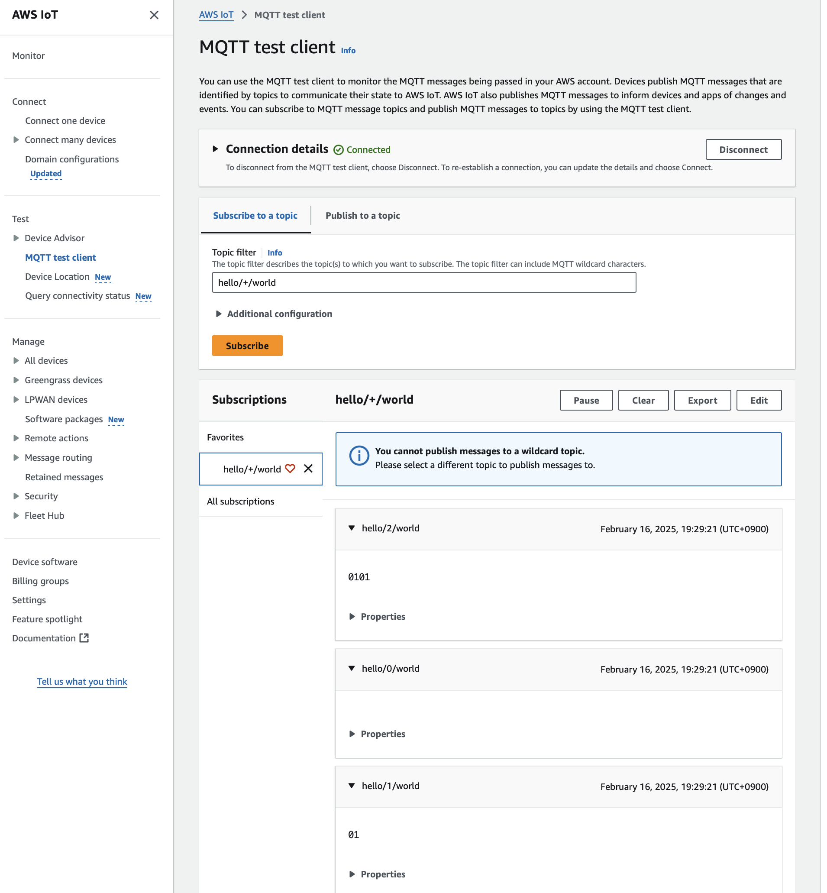

# mqtt_aws_macbook
このリポジトリはMacbookでAWS IoTに対してMQTT通信を行う練習用に作成したものです。

## 参考情報

* （書籍）[AWS IoT実践講座](https://www.amazon.co.jp/AWS-IoT実践講座-～デバイスの制御からデータの収集・可視化・機械学習まで～-小林-嗣直/dp/4297145189)
  * 2章「AWSとの接続」
    * ポリシーの作成
    * デバイス証明書の作成
* [WoongH/esp32-rust-aws-iot-example](https://github.com/WoongH/esp32-rust-aws-iot-example)
* [Rust(rumqttc)でMQTT](https://www.emqx.com/ja/blog/how-to-use-mqtt-in-rust)
* [bytebeamio/rumqtt](https://github.com/bytebeamio/rumqtt)
  * [tls2.rs](https://github.com/bytebeamio/rumqtt/blob/main/rumqttc/examples/tls2.rs)
  * [syncpubsub.rs](https://github.com/bytebeamio/rumqtt/blob/main/rumqttc/examples/syncpubsub.rs)

## ターミナル出力例

```bash
AWS_IOT_ENDPOINT: "ajlba85us9ja9-ats.iot.us-east-1.amazonaws.com"
Connected to AWS IoT Core
"hello/0/world"
"hello/1/world"
"hello/2/world"
Published messages
0. Notification = Incoming(ConnAck(ConnAck { session_present: false, code: Success }))
1. Notification = Outgoing(Subscribe(1))
2. Notification = Outgoing(Publish(2))
3. Notification = Outgoing(Publish(3))
4. Notification = Outgoing(Publish(4))
5. Notification = Incoming(SubAck(SubAck { pkid: 1, return_codes: [Success(AtMostOnce)] }))
6. Notification = Incoming(Publish(Topic = hello/0/world, Qos = AtMostOnce, Retain = false, Pkid = 0, Payload Size = 0))
7. Notification = Incoming(PubAck(PubAck { pkid: 2 }))
8. Notification = Incoming(Publish(Topic = hello/2/world, Qos = AtMostOnce, Retain = false, Pkid = 0, Payload Size = 2))
9. Notification = Incoming(Publish(Topic = hello/1/world, Qos = AtMostOnce, Retain = false, Pkid = 0, Payload Size = 1))
```

MQTT test client上でメッセージを確認できます。



### 認証情報が正しくない場合

この場合でもクライアントオブジェクトの生成は成功してしまうので注意が必要です。

```bash
AWS_IOT_ENDPOINT: "ajlba85us9ja9-ats.iot.us-east-1.amazonaws.com"
Connected to AWS IoT Core
"hello/0/world"
"hello/1/world"
"hello/2/world"
Published messages
0. Notification = Tls(NoValidCertInChain)
```
